<a id="readme-top"></a>

<div align="center">
  
</div>

<br/>

<div align="center">
  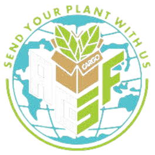
  <h3 align="center">AGF Cargo — PT Berkah Melano Indonesia</h3>
  <p align="center">
    Sistem informasi manajemen kargo tanaman hias berbasis Odoo<br/>
    IF3141 — Sistem Informasi · Kelompok 03 K01<br/>
    Institut Teknologi Bandung · 2026
  </p>
</div>

<div align="center">

<br/>


</div>

---

<!-- TABLE OF CONTENTS -->
<details>
  <summary>Daftar Isi</summary>
  <ol>
    <li><a href="#tentang-sistem">Tentang Sistem</a></li>
    <li><a href="#fitur-utama">Fitur Utama</a></li>
    <li><a href="#tech-stack">Tech Stack</a></li>
    <li><a href="#screenshots">Screenshots</a></li>
    <li><a href="#cara-menjalankan">Cara Menjalankan</a></li>
    <li><a href="#kredensial-demo">Kredensial Demo</a></li>
    <li><a href="#database-migration">Database Migration</a></li>
    <li><a href="#struktur-proyek">Struktur Proyek</a></li>
    <li><a href="#anggota-kelompok">Anggota Kelompok</a></li>
  </ol>
</details>

---

## Tentang Sistem

<a id="tentang-sistem"></a>

Sistem informasi **AGF Cargo** dibangun untuk PT Berkah Melano Indonesia — perusahaan jasa pengiriman tanaman hias internasional dari Indonesia ke Amerika Serikat. Sistem ini menggantikan alur manual berbasis Google Form dan WhatsApp dengan platform digital terpadu yang mencakup tiga portal yang saling terintegrasi secara *real-time*:

| Portal | Pengguna | Akses | URL |
|:---|:---|:---|:---|
| **Customer Portal** | Penitip & Penerima kargo | Publik (tanpa login) | `/agf/customer` |
| **Warehouse Web App** | Petugas Gudang | Login internal, mobile-first | `/agf/warehouse` |
| **Admin Dashboard** | Admin & Manajer Operasional | Login internal, desktop | `/agf/admin` |

Keseluruhan sistem dibangun sebagai satu modul kustom Odoo (`agf_cargo`) yang berjalan di atas kontainer Docker.

<div align="right"><a href="#readme-top">↖ Kembali ke atas</a></div>

---

## Fitur Utama

<a id="fitur-utama"></a>

<details>
<summary><b>F-01 · Customer Portal — Pendaftaran Kargo</b></summary>
<br/>

Penitip dapat mendaftarkan kargo secara mandiri melalui Customer Portal. Sistem memvalidasi data, menyimpan entri kargo baru dengan status awal `01_registrasi`, dan membangkitkan dua nomor pelacakan unik:
- **ID Penitip** (AGF-YYYY-XXXX) — untuk pengirim
- **ID Penerima** (TRK-YYYY-XXXX) — untuk penerima

</details>

<details>
<summary><b>F-02 · Customer Portal — Pelacakan Mandiri (Self-Tracking)</b></summary>
<br/>

Pelanggan dapat melacak status kargo secara *real-time* tanpa login, hanya dengan memasukkan nomor AGF- atau TRK-. Sistem menampilkan linimasa visual setiap tahapan beserta foto dokumentasi kondisi tanaman dan catatan petugas di setiap tahapan.

</details>

<details>
<summary><b>F-03 · Admin Portal — Manajemen Pesanan & Batch Aktif</b></summary>
<br/>

Admin dapat mengelola seluruh antrian pesanan dalam batch aktif: tambah pesanan baru, edit data kargo, update tahapan, dan pantau riwayat batch historis. Status seluruh kargo diperbarui otomatis berdasarkan log tahapan yang dibuat oleh petugas gudang maupun admin.

</details>

<details>
<summary><b>F-04 · Admin Portal — Dashboard Analitik</b></summary>
<br/>

Dashboard menyajikan metrik operasional: total kargo aktif, pesanan selesai, kargo bermasalah, progres batch berjalan, dan grafik volume kargo 7 hari terakhir. Dirancang untuk kebutuhan monitoring manajerial secara *real-time*.

</details>

<details>
<summary><b>F-05 · Admin Portal — Manajemen QR Tag Reusable</b></summary>
<br/>

Inventaris tag QR antiair yang dapat didaur ulang (*reusable*). Setiap pesanan baru secara otomatis mendapat tag QR yang tersedia (*idle*). Admin dapat membebaskan tag dari kargo yang selesai atau menandai tag yang rusak secara fisik.

</details>

<details>
<summary><b>F-06 · Warehouse Web App — Operasional Gudang via Scan QR</b></summary>
<br/>

Petugas gudang memindai QR tag fisik tanaman menggunakan kamera smartphone. Sistem menampilkan detail kargo terkait, lalu petugas mengisi:
- **Sub-tahap persiapan**: Pengecekan Awal → Pencucian → Pengemasan → Pengecekan Akhir
- ***Checklist* kondisi**: Daun OK, Akar OK, Bebas Hama
- **Foto dokumentasi** (maks. 4 foto)
- **Catatan** tambahan

Perubahan langsung tercermin di Admin Dashboard dan Customer Portal secara *real-time*.

</details>

<div align="right"><a href="#readme-top">↖ Kembali ke atas</a></div>

---

## Tech Stack

<a id="tech-stack"></a>

| Layer | Teknologi |
|:---|:---|
| Platform | Odoo 17 (Community) |
| Backend | Python 3.11 |
| Database | PostgreSQL 16 |
| Containerization | Docker + Docker Compose |
| View Layer | Odoo QWeb Templates (XML) |
| Styling | SCSS (3 stylesheet terpisah per portal) |
| QR Scanner | html5-qrcode v2.3.8 |
| Icons | Lucide Icons v0.462.0 |

<div align="right"><a href="#readme-top">↖ Kembali ke atas</a></div>

---

## Screenshots

<a id="screenshots"></a>

<details>
  <summary><b>Customer Portal (Mobile)</b></summary>
  <br/>

  <div align="center">

  | P-CP-01 Splash Screen | P-CP-02 Form Pendaftaran Kargo |
  |:---:|:---:|
  | 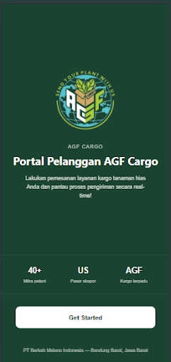 | 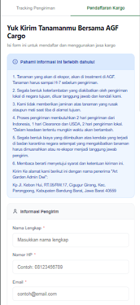 |

  | P-CP-03 Konfirmasi Pendaftaran | P-CP-04 Customer Order Tracker |
  |:---:|:---:|
  | 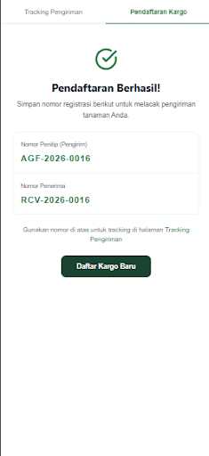 | 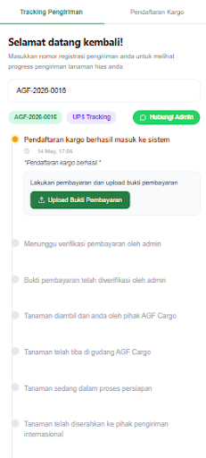 |

  </div>
</details>

<details>
  <summary><b>Warehouse Web App (Mobile)</b></summary>
  <br/>

  <div align="center">

  | P-WH-01 Landing Warehouse | P-WH-03 Home / Daftar Pesanan | P-WH-05 Scan QR Code |
  |:---:|:---:|:---:|
  | 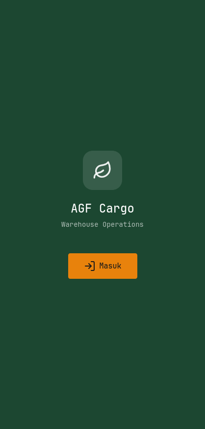 | 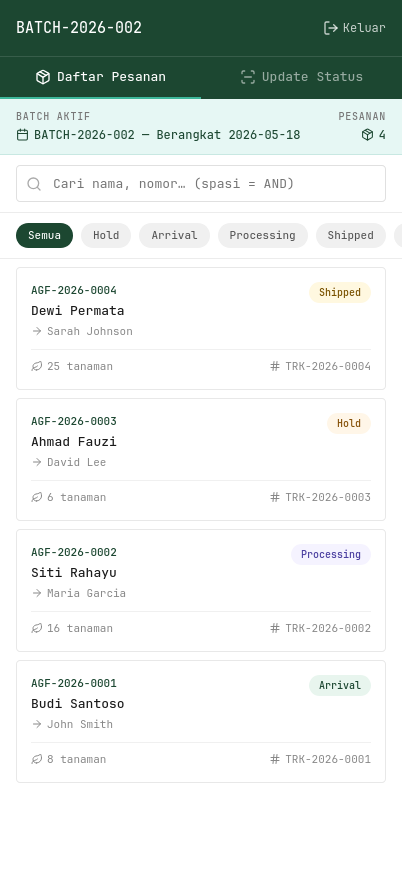 | 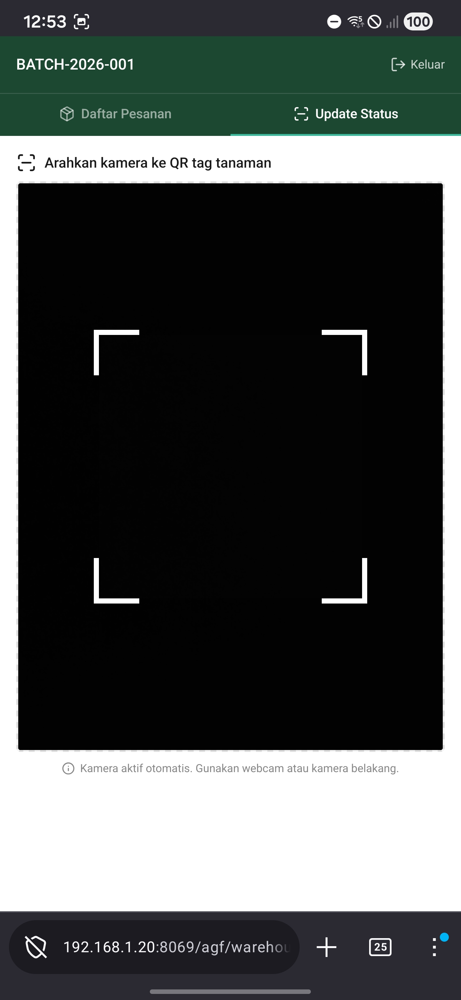 |

  | P-WH-04 Detail Pesanan | P-WH-06 Detail Tanaman (Post-Scan) |
  |:---:|:---:|
  | 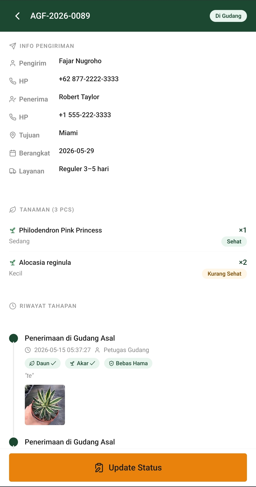 | 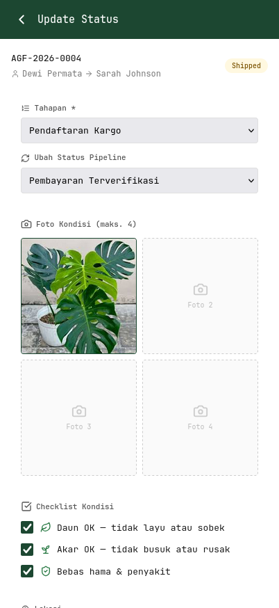 |

  </div>
</details>

<details>
  <summary><b>Admin Dashboard (Desktop)</b></summary>
  <br/>

  <div align="center">

  | P-AD-01 Dashboard Utama Admin | P-AD-02 Manajemen Pesanan | P-AD-03 Form Input Pesanan Baru |
  |:---:|:---:|:---:|
  | 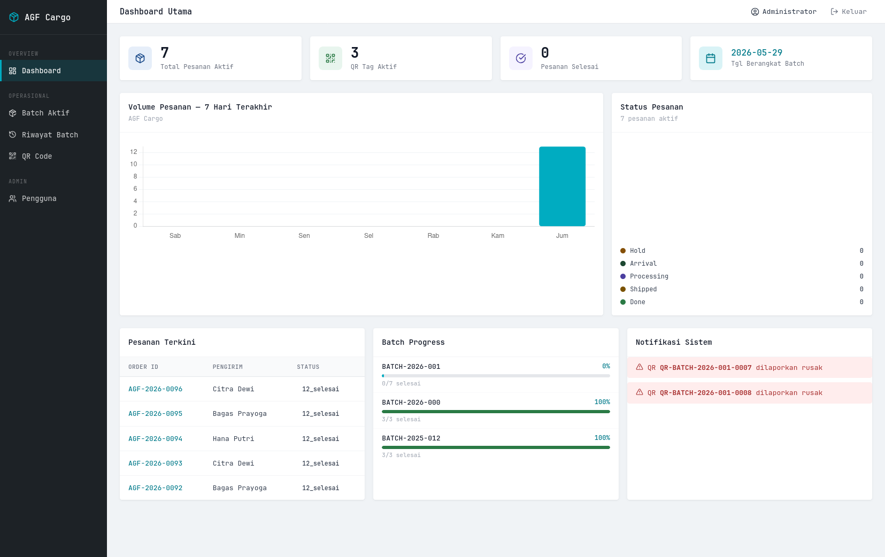 | 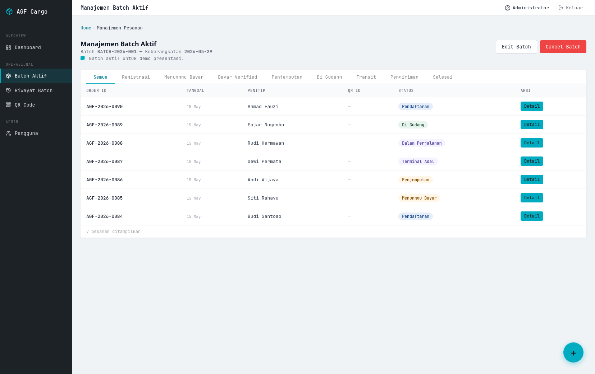 | 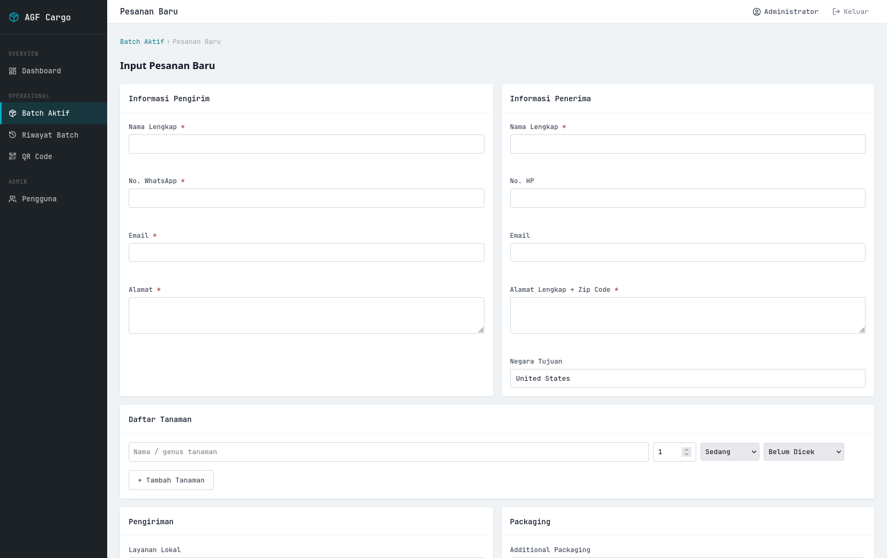 |

  | P-AD-04 Detail Pesanan (Admin) | P-AD-05 Riwayat Batch | P-AD-06 Detail Batch |
  |:---:|:---:|:---:|
  | 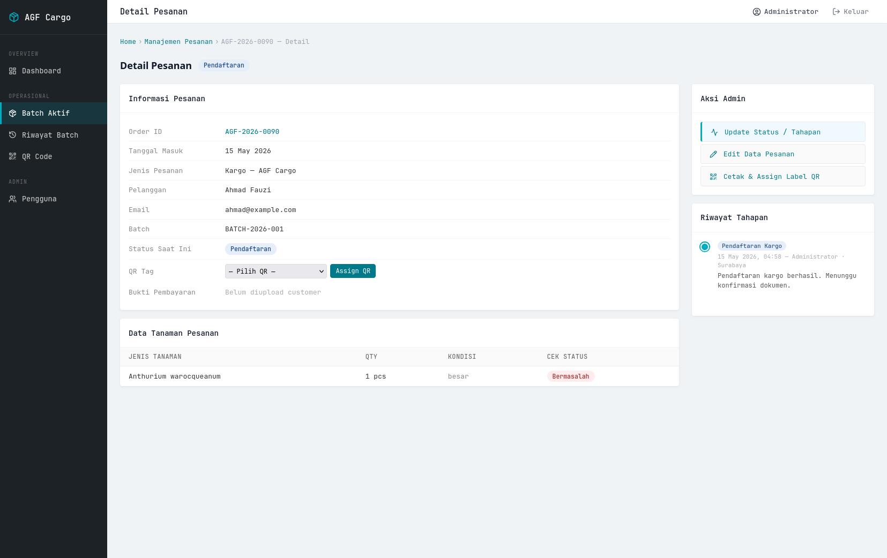 | 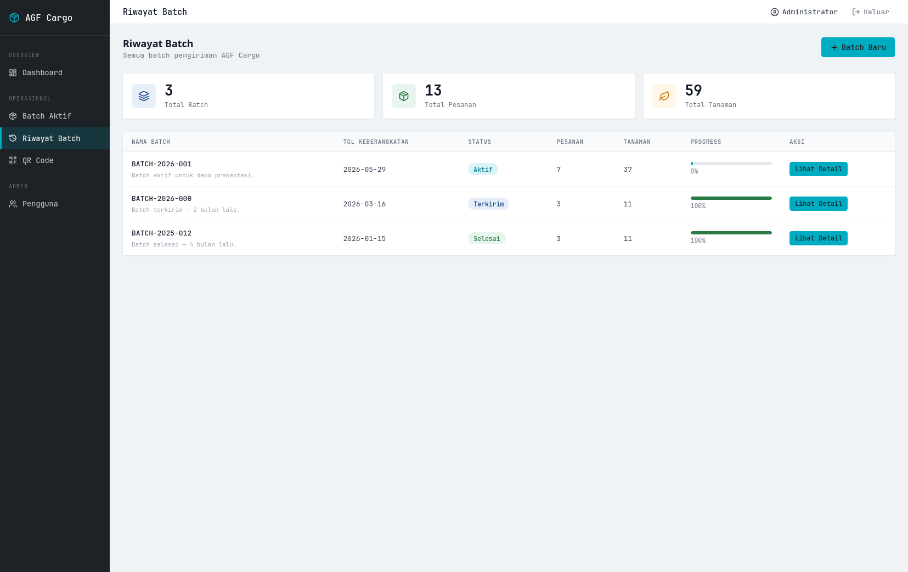 | 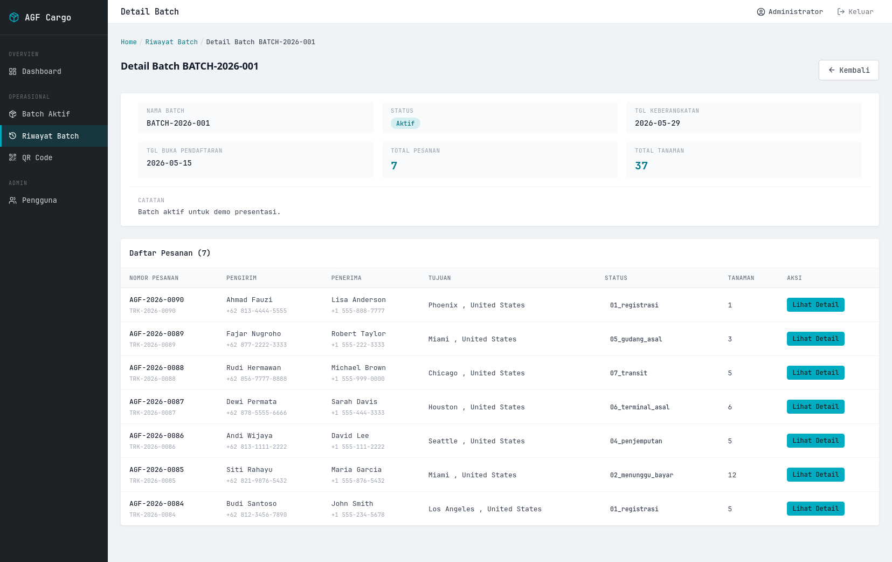 |

  | P-AD-07 Manajemen QR Code | P-AD-08 Manajemen Pengguna & Role |
  |:---:|:---:|
  | 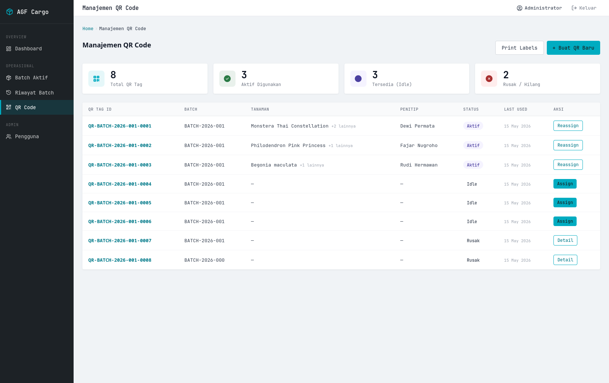 | 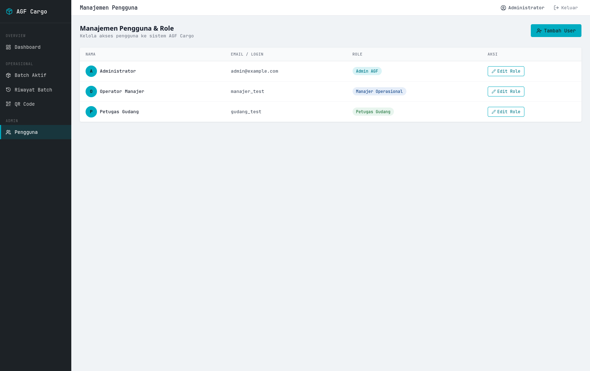 |

  </div>
</details>

<div align="right"><a href="#readme-top">↖ Kembali ke atas</a></div>

---

## Cara Menjalankan

<a id="cara-menjalankan"></a>

> **Prasyarat:** Docker Desktop terinstal dan aktif.

### 1. Clone Repository

```bash
git clone <repo-url>
cd IF3141-odoo-K01-G03
```

### 2. Jalankan Docker Compose

```bash
docker compose up -d
```

Tunggu hingga container `web` dan `db` berstatus **Up**:

```bash
docker compose ps
```

### 3. Update Modul

Wajib dilakukan saat pertama kali, atau setelah ada perubahan model/field:

```bash
# Stop web saja (DB tetap jalan)
docker compose stop web

# Update modul agf_cargo
docker compose run --rm web odoo \
  --db_host=db --db_port=5432 --db_user=odoo --db_password=password \
  -d postgres -u agf_cargo --stop-after-init

# Jalankan kembali
docker compose start web
```

### 4. Seed Data Demo

```bash
python3 scripts/seed_test_data_2.py --fresh
```

### 5. Buka Portal

| Portal | URL | Login |
|:---|:---|:---|
| Customer Portal | http://localhost:8069/agf/customer | Publik |
| Warehouse App | http://localhost:8069/agf/warehouse | `gudang_test` / `Test@1234` |
| Admin Dashboard | http://localhost:8069/agf/admin | `admin` / `admin` |

<div align="right"><a href="#readme-top">↖ Kembali ke atas</a></div>

---

## Kredensial Demo

<a id="kredensial-demo"></a>

| Role | Username | Password | Portal |
|:---|:---:|:---:|:---|
| Admin Odoo | `admin` | `admin` | Admin Dashboard |
| Manajer Operasional | `manajer_test` | `Test@1234` | Admin Dashboard |
| Petugas Gudang | `gudang_test` | `Test@1234` | Warehouse Web App |
| Penitip / Penerima | — (tanpa login) | — | Customer Portal |

Untuk mendapatkan nomor resi kargo demo setelah seeding:

```bash
python3 scripts/get_demo_info.py
```

<div align="right"><a href="#readme-top">↖ Kembali ke atas</a></div>

---

## Database Migration

<a id="database-migration"></a>

Sebelum melakukan migration, **matikan service terlebih dahulu**:

```bash
docker compose down
```

**Export** — setelah membuat perubahan data yang ingin dibagikan ke tim:

```bash
# macOS / Linux
./scripts/export_db.sh

# Windows
scripts\export_db.cmd
```

**Import** — mengambil perubahan database dari rekan tim:

```bash
# macOS / Linux
./scripts/import_db.sh

# Windows
scripts\import_db.cmd
```

<div align="right"><a href="#readme-top">↖ Kembali ke atas</a></div>

---

## Struktur Proyek

<a id="struktur-proyek"></a>

```
IF3141-odoo-K01-G03/
├── docker-compose.yml
├── config/
│   └── odoo.conf
├── scripts/
│   ├── seed_test_data_2.py       # Seed data demo
│   ├── get_demo_info.py          # Info nomor resi & login
│   ├── generate_qr_demo.py       # Generate QR PNG untuk demo
│   ├── export_db.sh / .cmd       # Export database
│   └── import_db.sh / .cmd       # Import database
├── dump/                         # Database dump files
└── custom_addons/
    └── agf_cargo/
        ├── __manifest__.py
        ├── models/
        │   ├── agf_batch.py
        │   ├── agf_kargo.py
        │   ├── agf_tanaman_item.py
        │   ├── agf_tahapan.py
        │   └── agf_qr_tag.py
        ├── controllers/
        │   ├── customer_portal.py
        │   ├── warehouse_portal.py
        │   └── admin_portal.py
        ├── views/
        │   ├── customer/
        │   ├── warehouse/
        │   └── admin/
        ├── security/
        │   ├── groups.xml
        │   └── ir.model.access.csv
        └── static/src/scss/
            ├── _variables.scss
            ├── portal_customer.scss
            ├── portal_warehouse.scss
            └── portal_admin.scss
```

<div align="right"><a href="#readme-top">↖ Kembali ke atas</a></div>

---

## Anggota Kelompok

<a id="anggota-kelompok"></a>

<div align="center">

| NIM | Nama |
|:---:|:---|
| 13523009 | M Hazim R Prajoda |
| 13523016 | Clarissa Nethania Tambunan |
| 13523041 | Hanif Kalyana Aditya |
| 13523053 | Sakti Bimasena |
| 13523058 | Noumisyifa Nabila Nareswari |

**Kelompok G03 · K01 · IF3141 Sistem Informasi**<br/>
Sekolah Teknik Elektro dan Informatika<br/>
Institut Teknologi Bandung · 2026

</div>

<div align="right"><a href="#readme-top">↖ Kembali ke atas</a></div>

---

<div align="center">
  
</div>
